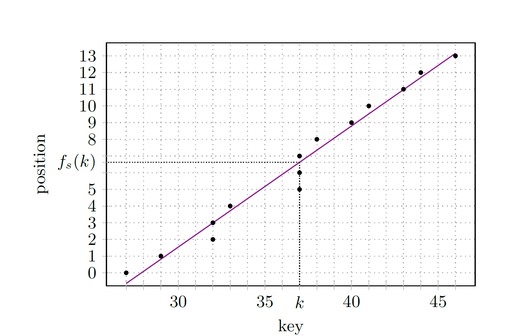
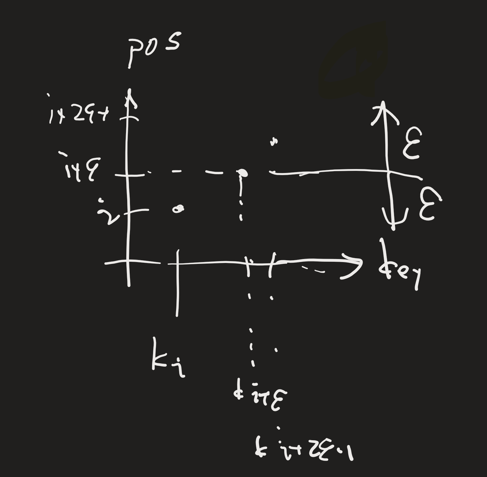
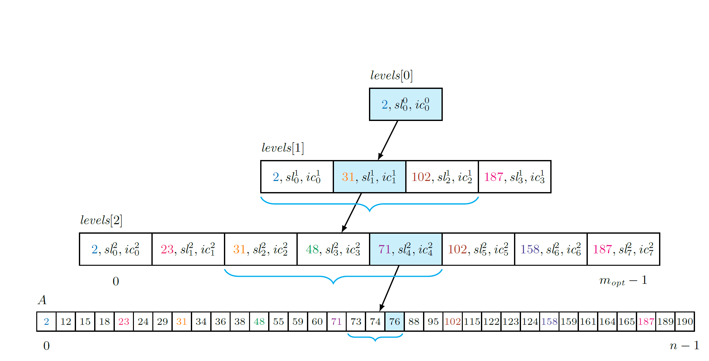

# PGM-index

## 概要

- PLA-model(区分的線形近似モデル)
- 再帰的なindex構造

### PLA-modelについて

key k-->配列Aのpositionを誤差εで予測
誤差±εの範囲を二分探索すれば、正確な位置を求めることができる. log(ε)

### 再帰的なindex構造について

- 1つのセグメントが、定数時間と空間量で、任意の長さの配列をindexできることを活用
- 配列AのPLA-modelをkeysの部分集合とみなして、これから- PLA-modelを作る
- それのPLA-modelを作る
- 繰り返す　

## PLA-modelについて

segment $s := (key_s,slope_s,intercept_s)$
とし、key kのpositionは、
$$f_s(k) = k*slope_s + intecept_s $$
で与えられる.

**Def 1.**
- A: ソート済み、keyはn個
- ε: 整数、１以上

ある$k_i,k_{i+r} \in \mathcal{U} $が存在して, $k_{i}\leq x \leq k_{i+r}$ を満たす任意のxに対して
$|f_s(x)-rank(x)| \leq \epsilon$
が成り立つとき、

セグメントsが$[k_i,k_{i+r}]$の範囲のすべてのkeyをε-approximate indexingするという.

**Def 2.**
$piecewise$ $linear$ $\epsilon$ $- approximation$ $problem$は、セグメント{ $s_0,....,s_{m-1}$ }の数を最小化するPLA-modelを計算する問題

### 凸包

$piecewise$ $linear$ $\epsilon$ $- approximation$ $problem$は集合の要素の凸包を形成する問題に還元できる

集合$\lbrace ( k_i,rank(k_i) ) \rbrace$ $i = 0,...,n-1$に対して

- 高さ$2\epsilon$の長方形で囲める場合、$i$をインクリメント
- 高さが$2\epsilon$を超えると、構築を中止し、その矩形を分割する直線をセグメントとして決定する。
- 集合を空にして、残りの入力についてアルゴリズムを再開する

このgreedy algorithmは最適なセグメント数を求めることができ、線形時間と空間量を要する

今回の場合に言い換えると、

**Lem.1**

ある列 $\lbrace (x_i,y_i) \rbrace$ (但し、$x$ は広義単調増加)が与えられたとき、線形時間・空間量で、$y$ を$\pm \epsilon$で近似する最小の数のセグメントを求めるアルゴリズムが存在する

dictionaryの場合,

$piecewise$ $linear$ $\epsilon$ $- approximation$ $problem$は集合の要素の凸包を形成する問題に還元できる

集合$\lbrace ( k_i,rank(k_i) ) \rbrace$ $i = 0,...,n-1$に対して

- 高さ$2\epsilon$の長方形で囲める場合、$i$をインクリメント
- 高さが$2\epsilon$を超えると、構築を中止し、その矩形を分割する直線をセグメントとして決定する。
- 集合を空にして、残りの入力についてアルゴリズムを再開する

このgreedy algorithmは最適なセグメント数を求めることができ、線形時間と空間量を要する

今回の場合に言い換えると、

**Lem.1**

ある列 $\lbrace (x_i,y_i) \rbrace$ (但し、$x$ は広義単調増加)が与えられたとき、線形時間・空間量で、$y$ を$\pm \epsilon$で近似する最小の数のセグメントを求めるアルゴリズムが存在する

dictionaryの場合、

$x_i$ は $k_i$ に対応し、$y_i$ は $position$ に対応する

$x_i$ は $k_i$ に対応し、$y_i$ は $position$ に対応する

### 1つのセグメントがカバーできるkeyの数について

**Lem.2**

直交座標系上の点の列$\lbrace (k_i,i) \rbrace$が与えられたとき、(但し、$x,y$軸について広義単調増加)
Lem.1のアルゴリズムは、$m_{opt} \le \frac{n}{2\epsilon}$を満たす、セグメント数$m_{opt}$を決定し、1つのセグメントは少なくとも$2\epsilon$個の点をカバーする

proof.


よって各セグメントは最低でも$2\epsilon$個のkeyをカバーする.

つまり、極論
segment $s = (k_i, 0,i+\epsilon)$とすれば, このセグメントは$\pm \epsilon$の誤差を許すとすると正しい.
分布に従った、直線を見つけてくると、よりたくさんのkeyをカバーできる.

### 対応するsegmentを求める

Lem.1のアルゴリズムは、入力Aの最適PLA-modelとしてセグメント列[ $s_0,...,s_{m-1}$ ]を求める.

完全にindex可能な辞書問題を解くには,
query key $k$の 近似推定位置 $pos$ を求める segment $s_j$ を見つける必要がある

すなわち、
$$ s_j .key \le k$$
を満たす最大の $j$ である.

(理由:Lem.1のアルゴリズム)

### strategy
1. 列 $M$ を入力 $A$で構成する.
2. 各セグメントの先頭のkeyを取り出し、この取りだされたkeyの集合に対して、最適PLA-modelを構成する.
3. 以上を、セグメント数が1になるまで繰り返す

### PGM-indexの利点
1. 可変fan-outを持つ. すなわち、セグメントがカバーするキーの数が、子ノードの数となる
2. セグメントは、定数時間と空間量の  $ \epsilon$ 近似のルーティングテーブルを表す.
3. 各ノードでの探索は、二分探索によって、ε近似のpositionを修正する. $O(log(\epsilon) )$ の時間を要する.segmentのkeyの数に依存しない


<sub> fan-outは子ノードの数を表す

### 再帰的PGM-indexのクエリ操作
1. 各levelで、訪問したノードの参照するセグメントを使用して、検索されたkey k が下位レベルのkeyのどの位置にあるかを推定する。
2. 推定された位置を中心とした2εの範囲での二値探索によって、 実際の位置を求める。
3. 最後まで繰り返し

```
Query(A,n,ε,levels,k)
    pos = fr(k), where r = levels[0][0]
    for i = 1 to SIZE(levels)-1
        lo = max{pos-ε,0}
        hi = min{pos+ε,Size(levels[i])-1}
        s = the rightmost segment s' in levels[i][lo,hi] such that s'.key <= k
        t = the segment at the right of s
        pos =⌊min{fs(k),ft(t.key)}⌋
    lo = max{pos-ε,0}
    hi = min{pos+ε,n-1}
    return search for k in A[lo,hi]
```


**Them.1**

n個のkeyからなる順序配列 $A$ 、整数$\epsilon \ge 1$を固定整数パラメータとする.

このとき、パラメータ $\epsilon$  で定義されるPGM-indexは, 
空間量$ \Theta(m) $ で $A$ をインデックスづけ,
membershipとpredecessorクエリを時間$O(log\space m +log \space \epsilon )$, I/O は $O((log_c\space m)log(\epsilon /B))$


但し, 
- $m$ は $A$ をカバーする $\epsilon $ 近似セグメントの最小数
- $c\space(\ge 2\epsilon)$はデータ構造の可変fan-out
- Bは外部メモリモデルのブロックサイズ

範囲は余分な時間 $O(K)$ ,とI/Oは $O(K/B)$ 

- $K$ は範囲クエリを満たすkeyの数

proof.

再帰の各ステップで、セグメントの数を $c(\ge 2 \epsilon+1)$ だけ減らす.
よってレベル数 $L$ は, $L = O(log_c \space m)$ .
また, indexに必要な総空間量は, $ \sum_{l = 0}^L \frac{m}{(2\epsilon+1)^l} = \Theta(m)$.

membership, rank, predecessorクエリにおいて、時間の上限とI/Oは最大で $2\epsilon+1$ の二分探索を $L+1$ 回実行するので, 時間は $O((L+1)\space log(2\epsilon+1)) = O((log_c\space m + 1)log(2\epsilon+1))$

$$log_c \space m = \frac{log \space m}{log \space c} \le \frac{log \space m}{log \space (2\epsilon+1)}$$

よって,
$$ O((L+1)log(2\epsilon+1)) = O(log(m))+O(log(\epsilon))$$

- $\Theta(g(n))$とは, ある定数$c_1,c_2,n_0$が存在して, $n\ge n_0$に対して, $0 \le c_1 g(n) \le f(n)\le c_2 g(n)$ を満たす $f(n)$ の集合

# 実験

## 論文で行われた実験
- uniform 区間[0,u]
- 指数sのZipf分布
- 標準偏差σの対数正規分布